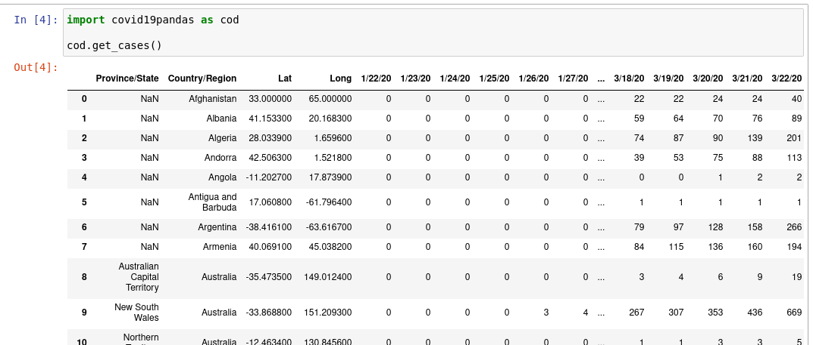

# covid19pandas
This package presents COVID-19 data from [Johns Hopkins University](https://github.com/CSSEGISandData/COVID-19) in pandas dataframes, to make analysis and visualization easier in a Python environment.

# Install
Install the package via pip: `pip install covid19pandas`

# Usage
After importing the package, the `get_cases`, `get_deaths`, and `get_recovered` functions can be called to access the corresponding tables.

